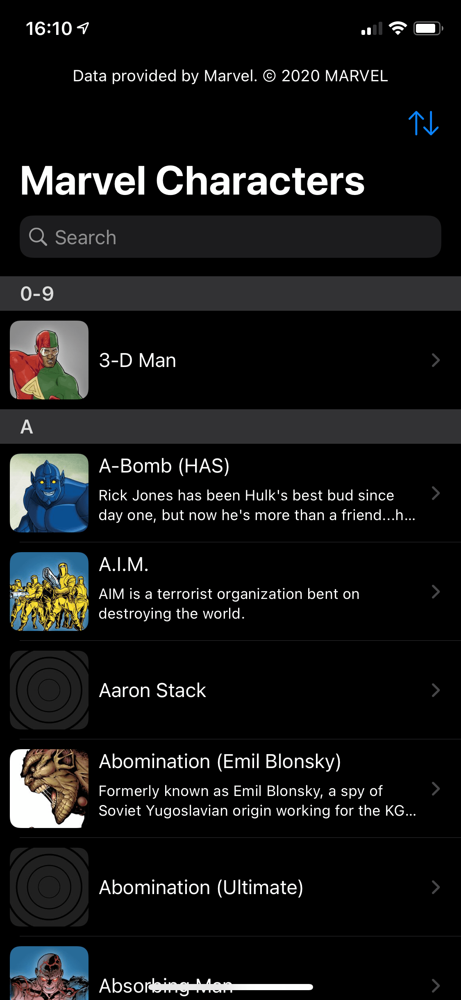
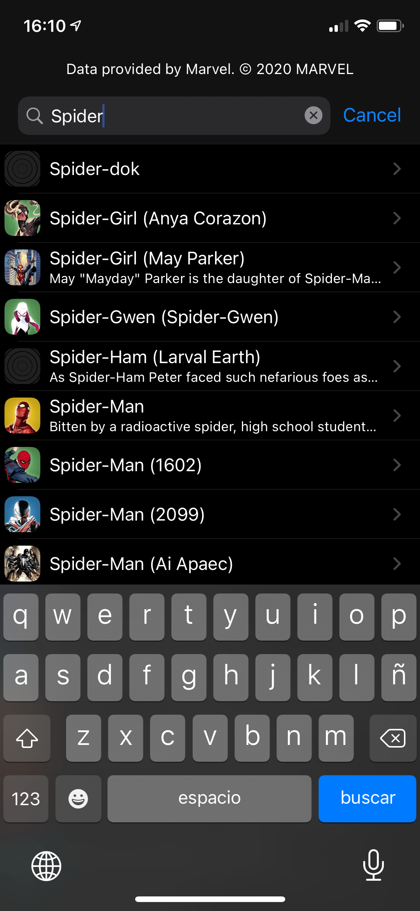
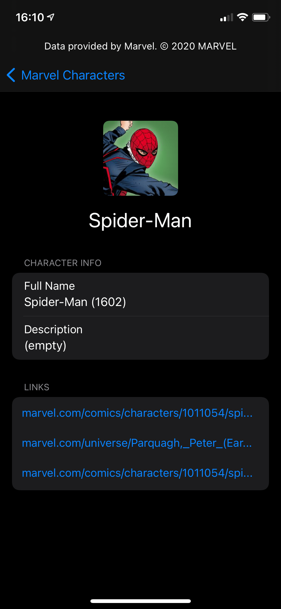

# Marvel Characters demo app

Mini app that uses marvel characters api to display and search marvel characters.

## Features
- Display a sorted list of characters
- Change list order
- Display characters details
- Search by charcter name
- Caching mechanisms for faster data loading
- Usage of the new storyboards API
- Usage of the new diffable data source API for tableView (available right now in the branch: feature/diffableDataSource)

## Installation [IMPORTANT]

- This app uses the official marvel api: https://developer.marvel.com/docs
- To setup the project, **you need to get the marvel api developer keys AND add "\*" in "Your authorized referrers" (https://developer.marvel.com/account)**.
  - Then you need look at this file **"Marvel Characters/config/Keys.example.xcconfig"**. Copy its contents replacing the api keys with yours and create a new file on the same folder named "Keys.xcconfig". The project should automatically pick up that file and use your api keys.
- There is only one external dependency, ZippyJSON, but is should load automatically with the Swift Package Manager

## Extra

- There is a development branch featuring the new [diffable Apple API](https://developer.apple.com/documentation/uikit/uitableviewdiffabledatasource), named 'feature/diffableDataSources'.

## Screenshots

  
  
  

### Credits
- [Icons](https://icons8.com/icon/pack/cinema/color): Some icons used for the app icon.
- [ZippyJSON](https://github.com/michaeleisel/ZippyJSON): Used for faster JSON decoding (only works on real devices, when using simulator it uses the standard JSONDecoder from Apple).
- Some articles that helped:
  - https://medium.com/@alfianlosari/using-diffable-data-source-ios-13-api-in-uitableview-47343c2332be
  - https://stephenradford.me/make-uilabel-copyable/

